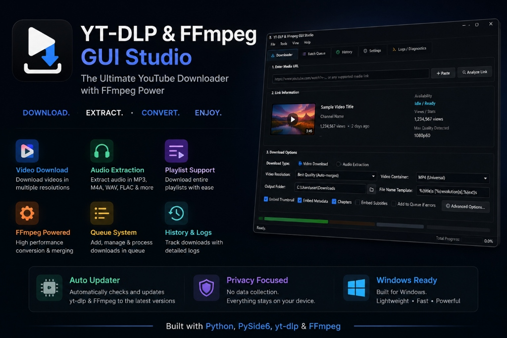

<p align="center">
  
</p>

<p align="center">
  
  
  
  
  
  
</p>

<h1 align="center">⚡ YT-DLP & FFmpeg GUI Studio (<code>yt-mpeg-gui</code>)</h1>

<p align="center">
  <b>The Ultimate Standalone Desktop Media Downloader and Transcoder for Windows.</b><br>
  DOWNLOAD. EXTRACT. CONVERT. ENJOY.
</p>

---

## 🌟 Key Features

- 🎥 **Universal Media Downloader**: Supports YouTube, TikTok, Instagram, Twitter/X, Reddit, Twitch, Vimeo, Facebook, and 1000+ websites.
- ⚡ **Integrated High-Speed FFmpeg**: Bundles full codec-packed `ffmpeg.exe` for stream demuxing, audio-video merging, thumbnail embedding, and fast format conversion.
- ⏸️ **Live Pause & Resume**: Pause and unpause active downloads on the fly without network timeouts or losing downloaded chunks.
- 🔄 **1-Click Engine Auto-Updater**: In-app background update engine that queries official GitHub releases for both **yt-dlp** and **FFmpeg**.
- 🔍 **Instant Media Inspection**: Live thumbnail preview, channel details, duration, view count, and available stream resolutions before downloading.
- 📦 **Rich Format & Quality Controls**:
  - **Video + Audio**: Best Quality (auto-merged), 4K Ultra HD (2160p), 2K Quad HD (1440p), 1080p FHD, 720p HD, 480p SD, 360p.
  - **Containers**: MP4 (Universal), MKV (Matroska), WEBM, AVI, MOV.
  - **Audio Extraction**: Lossless FLAC, WAV, MP3 (320kbps / 256kbps / 192kbps / 128kbps), M4A (AAC), OPUS.
- 📋 **Batch Queue Manager**: Bulk URL importer supporting multi-line paste with individual progress tracking, pause, resume, and bulk management.
- 💬 **Subtitles & Metadata**: Embed subtitles or export standalone `.srt`/`.vtt` files, embed video thumbnails into media files, and embed chapter markers.
- 🛡️ **SponsorBlock Integration**: Automatically remove sponsor segments, intros, outros, and self-promos.
- 🍪 **Cookie & Authentication Support**: Extract cookies directly from installed browsers (Chrome, Edge, Firefox, Brave, Opera, Vivaldi) or custom `cookies.txt` files for private / member-only / age-restricted content.
- 🌐 **Network & Performance**: Download rate limiting, concurrent fragment multi-threading, and custom proxy support (HTTP/HTTPS/SOCKS5).
- 📁 **Download History**: Integrated history browser with quick "Play File" and "Show in Folder" shortcuts.
- 📜 **Live Diagnostics Console**: Real-time colored yt-dlp & FFmpeg log viewer.

---

## 📦 Download Standalone Executable (.exe)

Pre-built portable packages are available under [GitHub Releases](https://github.com/hazynyx/yt-mpeg-gui/releases):

1. Download **`yt-dlp-gui-windows-x64.zip`** from the latest release.
2. Extract the ZIP to any folder.
3. Launch **`yt-dlp-gui.exe`** — no Python or FFmpeg installation required!

---

## 🚀 Running from Source

### Requirements
- Python 3.10+
- PySide6, yt-dlp, Pillow, requests

### Installation

```bash
# 1. Clone repository
git clone https://github.com/hazynyx/yt-mpeg-gui.git
cd yt-mpeg-gui

# 2. Install dependencies
pip install -r requirements.txt

# 3. Launch application
python main.py
```

---

## 🔨 Building Standalone Executable (.exe)

To compile a standalone Windows executable that packages the Python app, PySide6, `yt-dlp`, and `ffmpeg.exe`:

```bash
# 1. Build executable
python build_exe.py

# 2. (Optional) Create ready-to-upload ZIP for GitHub Releases
python package_release.py
```

The compiled application is generated in `dist/yt-dlp-gui/`, and the zip archive is saved to `dist/yt-dlp-gui-windows-x64.zip`.

---

## 📁 Project Structure

```
yt-mpeg-gui/
├── gui_app/
│   ├── __init__.py
│   ├── app.py                # Main window & application lifecycle
│   ├── assets/               # High-res logos, banner & icons (.png, .ico)
│   ├── assets_manager.py     # Vector icon & UI asset provider
│   ├── engine.py             # Asynchronous yt-dlp & FFmpeg download worker
│   ├── ffmpeg_finder.py      # Binary locator for bundled & user FFmpeg
│   ├── settings_manager.py   # Persistent JSON config & history storage
│   ├── styles.py             # Modern Glassmorphic Dark stylesheet
│   ├── updater.py            # Automated GitHub engine updater & modal
│   └── widgets/
│       ├── __init__.py
│       ├── downloader_tab.py # Single URL analyzer & downloader
│       ├── queue_tab.py      # Batch URL downloader
│       ├── history_tab.py    # Download history manager
│       ├── settings_tab.py   # Comprehensive configuration panel
│       └── logs_tab.py       # Live diagnostics console
├── build_exe.py              # PyInstaller build automation script
├── package_release.py        # Release zip packager for GitHub Releases
├── main.py                   # Root entry launcher
├── requirements.txt          # Python dependencies
├── LICENSE                   # GNU GPL-3.0 License
└── .gitignore                # Git exclusions
```

---

## 📄 License & Legal Notice

This project is licensed under the **GNU General Public License v3.0 (GPL-3.0)**. See the [LICENSE](LICENSE) file for complete details.

### Third-Party Software & Attributions
- **FFmpeg**: Licensed under the GNU General Public License (GPL) v2+/v3+. FFmpeg is a trademark of Fabrice Bellard, originator of the FFmpeg project. ([ffmpeg.org](https://ffmpeg.org))
- **yt-dlp**: Licensed under The Unlicense (Public Domain). ([github.com/yt-dlp/yt-dlp](https://github.com/yt-dlp/yt-dlp))
- **PySide6 / Qt6**: Licensed under LGPLv3. ([qt.io](https://www.qt.io))
